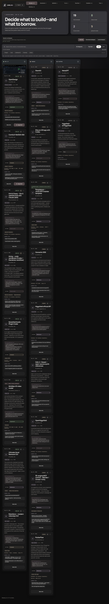

# LinkLabz

> Every link gets a verdict, the useful parts get harvested, and only the strongest ideas become paste-ready work.

[](https://agentzlab.github.io/LinkLabz/)
[](https://github.com/agentzlab/LinkLabz/commits/main)
[](https://github.com/agentzlab/LinkLabz)
[](https://agentzlab.github.io/LinkLabz/)

**Live preview:** https://agentzlab.github.io/LinkLabz/



## What's inside

LinkLabz is Jon's visual link review board — a single-page app for working through saved links in batches:

- **Reviews** — the review queue: verdict first, harvest notes second, park or promote
- **Bookmarks** — the raw shelf
- **Spitballs** — half-formed ideas worth keeping
- **To-do** — review follow-ups
- **Favorites** — the keepers
- **Gradients** — the design-fuel pile
- **Tools** — utilities
- **Raindrop** — reviewed keepers from Jon's Raindrop sweeps, graded and filterable. Card deck → click for full detail → ← Prev / Next → through the deck → ← Deck to go home. Filters: text search, lane, source collection, status, minimum grade. New sweep batches append to the deck — it never becomes a dump.

## Design language

Dark charcoal surfaces, warm gold accents, red top-edge on cards. No light mode — dark is locked. Cards carry lane chips, status pills, and star grades at a glance; detail view keeps verdict, why-it-matters, and harvest notes one scroll deep.

## Tech stack

| Layer | Choice |
|---|---|
| App | Single-file HTML (`index.html`) — no build step |
| Styling | Hand-rolled CSS, dark theme only |
| Logic | Vanilla JS, in-file |
| Data | In-file JSON seed batches (append per sweep) |
| Hosting | GitHub Pages, static |

## Project structure

```
LinkLabz/
├── index.html            # the whole app
├── assets/
│   └── screenshot.png    # dark-mode hero screenshot
├── README.md
└── .nojekyll             # Pages serves as-is
```

## Workflow

Changes land on **branches, never direct to main**. No pull requests unless Jon asks — he reviews the branch and merges. Merging to `main` is what goes live on Pages.
